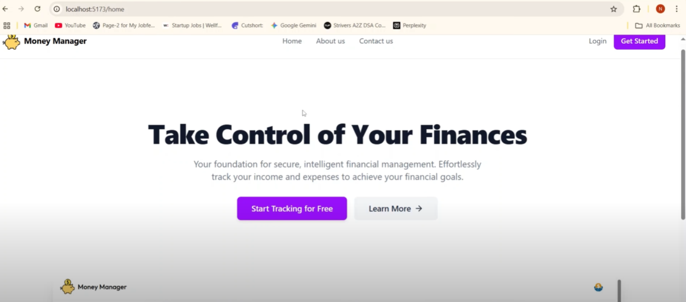

# Money Manager Java Fullstack Project

**Live Demo:** [Money Manager App](https://money-manager-1-ri1z.onrender.com/home)  
**GitHub Repo:** [Money-Manager-Java-Fullstack-Project](https://github.com/harshita-d12/Money-Manager-Java-Fullstack-Project)

---

## Table of Contents
- [Overview](#overview)
- [Demo](#demo)
- [Features](#features)
- [Technologies](#technologies)
- [Screenshots](#screenshots)
- [Achievements & Learning](#achievements--learning)
- [Author & Contact](#author--contact)

---

## Overview
Money Manager is a **full-stack web application** designed to help users efficiently manage their income, expenses, and categories. It offers secure authentication, real-time transaction tracking, powerful data filtering, and visual dashboards—built with Java, Spring Boot, MySQL, React, and JWT for reliability and a seamless user experience.

---

## Demo
Watch the demo video to see the application in action:

Click the image above or [click here](https://www.youtube.com/watch?v=J5TXq3BWTPA) to watch the full demo on YouTube.

---

## Features
- 💰 Income & Expense Tracking: Add, modify, and organize financial transactions.
- 🎯 Category Management: Create and manage custom categories.
- 🔎 Data Filtering: Instantly filter transactions by category or keyword for easy analysis.
- 📊 Personalized Dashboard: View summaries and trends with clear charts and graphs.
- 🔐 Authentication: Secure access using JWT and Spring Security.
- ⚙️ RESTful APIs: Robust backend integration with Java Spring Boot.
- ⚛️ Dynamic Frontend: Responsive React UI for smooth user interaction.
- 🔄 Real-Time Updates: Immediate feedback on changes and new entries.

---

## Technologies
| Technology         | Usage                         |
|--------------------|------------------------------|
| Java               | Backend logic & APIs          |
| Spring Boot        | Backend framework & Security  |
| MySQL              | Database                     |
| React.js           | Frontend UI                  |
| JWT                | Secure authentication        |
| HTML, CSS          | Styling and layout           |
| Tailwind CSS       | Additional responsive styling|

---

## Screenshots
Below are screenshots illustrating key features in the app:

  
*Dashboard*

  
*Personal dashboard for individual transaction summaries*

  
*Income tracking and analysis*

  
*Manage categories for efficient data organization*

  
*Robust data filtering for fast searching and reporting*

---

## Achievements & Learning
- Developed secure RESTful APIs for key financial operations.
- Implemented robust JWT authentication and role-based controls.
- Designed interactive dashboards with clear financial visualizations.
- Enhanced usability with instant filter/search capabilities.

---

## Author & Contact
**Harshita Dutta**  
- Email: [harshitadutta1272@gmail.com](mailto:harshitadutta1272@gmail.com)  
- LinkedIn: [harshita-dutta](https://linkedin.com/in/harshita-dutta)  
- GitHub: [harshita-d12](https://github.com/harshita-d12)  
